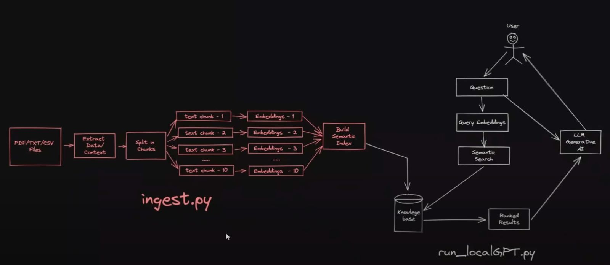

# MyLocalGPT

This is a mini-implementation of my own LocalGPT using Llama2.

## How to Use?
- Clone the repo.
- Install the requirements.
- Store the source documents in the `SOURCE_DOCUMENTS` folder.
- Run the `ingest.py` file to ingest the source documents to store the embeddings in a vectorstore.
- Run the `run_localGPT.py` file to run the LocalGPT on the local device.
- Modify the `constants.py` file to change the device and model parameters of the LocalGPT.

## Run in Notebook
- Run the `LocalGPT.ipynb` file to run the LocalGPT in Jupyter Notebook. Make sure to enable GPU in the notebook settings.

## Architecture


## Sample Output

This lists all the sources and the corresponding text chunks that are relevant to the query.

```shell-session
> Question:
What is a Large Language Model?

> Answer:
 A large language model refers to a type of artificial intelligence (AI) model designed to process and generate human-like text, typically using deep learning techniques such as recurrent neural networks (RNNs), long short-term memory (LSTM) networks, or transformers. These models are trained on vast amounts of text data and can perform various tasks such as language translation, text summarization, and text generation. The term "large" refers to the model's size in terms of parameters (i.e., millions or billions of parameters), which affects its performance and capabilities.
----------------------------------SOURCE DOCUMENTS---------------------------

> /Users/sampadk04/Desktop/Coding/Active_Projects/MyLocalGPT/SOURCE_DOCUMENTS/GPT-3-Language Models are Few-Shot Learners.pdf:
8 Conclusion

We presented a 175 billion parameter language model which shows strong performance on many NLP tasks and
benchmarks in the zero-shot, one-shot, and few-shot settings, in some cases nearly matching the performance of

40


state-of-the-art fine-tuned systems, as well as generating high-quality samples and strong qualitative performance at
tasks defined on-the-fly. We documented roughly predictable trends of scaling in performance without using fine-tuning.
We also discussed the social impacts of this class of model. Despite many limitations and weaknesses, these results
suggest that very large language models may be an important ingredient in the development of adaptable, general
language systems.

Acknowledgements

> /Users/sampadk04/Desktop/Coding/Active_Projects/MyLocalGPT/SOURCE_DOCUMENTS/GPT-3-Language Models are Few-Shot Learners.pdf:
Several lines of work have focused on increasing parameter count and/or computation in language models as a
means to improve generative or task performance. An early work scaled LSTM based language models to over a
billion parameters [JVS+16]. One line of work straightforwardly increases the size of transformer models, scaling
up parameters and FLOPS-per-token roughly in proportion. Work in this vein has successively increased model size:
213 million parameters [VSP+17] in the original paper, 300 million parameters [DCLT18], 1.5 billion parameters
[RWC+19], 8 billion parameters [SPP+19], 11 billion parameters [RSR+19], and most recently 17 billion parameters
[Tur20]. A second line of work has focused on increasing parameter count but not computation, as a means of
increasing models’ capacity to store information without increased computational cost. These approaches rely on the
conditional computation framework [BLC13] and specifically, the mixture-of-experts method [SMM+17] has been

> /Users/sampadk04/Desktop/Coding/Active_Projects/MyLocalGPT/SOURCE_DOCUMENTS/GPT-3-Language Models are Few-Shot Learners.pdf:
Another line of work goes in the opposite direction from scaling, attempting to preserve strong performance in language
models that are as small as possible. This approach includes ALBERT [LCG+19] as well as general [HVD15] and

39


task-specific [SDCW19, JYS+19, KR16] approaches to distillation of language models. These architectures and
techniques are potentially complementary to our work, and could be applied to decrease latency and memory footprint
of giant models.

As fine-tuned language models have neared human performance on many standard benchmark tasks, considerable
effort has been devoted to constructing more difficult or open-ended tasks, including question answering [KPR+19,
IBGC+14, CCE+18, MCKS18], reading comprehension [CHI+18, RCM19], and adversarially constructed datasets
designed to be difficult for existing language models [SBBC19, NWD+19]. In this work we test our models on many
of these datasets.

> /Users/sampadk04/Desktop/Coding/Active_Projects/MyLocalGPT/SOURCE_DOCUMENTS/GPT-3-Language Models are Few-Shot Learners.pdf:
Another recent trend in language modeling may offer a way forward. In recent years the capacity of transformer
language models has increased substantially, from 100 million parameters [RNSS18], to 300 million parameters
[DCLT18], to 1.5 billion parameters [RWC+19], to 8 billion parameters [SPP+19], 11 billion parameters [RSR+19],
and finally 17 billion parameters [Tur20]. Each increase has brought improvements in text synthesis and/or downstream
NLP tasks, and there is evidence suggesting that log loss, which correlates well with many downstream tasks, follows a
smooth trend of improvement with scale [KMH+20]. Since in-context learning involves absorbing many skills and
tasks within the parameters of the model, it is plausible that in-context learning abilities might show similarly strong
gains with scale.
----------------------------------SOURCE DOCUMENTS---------------------------
```
